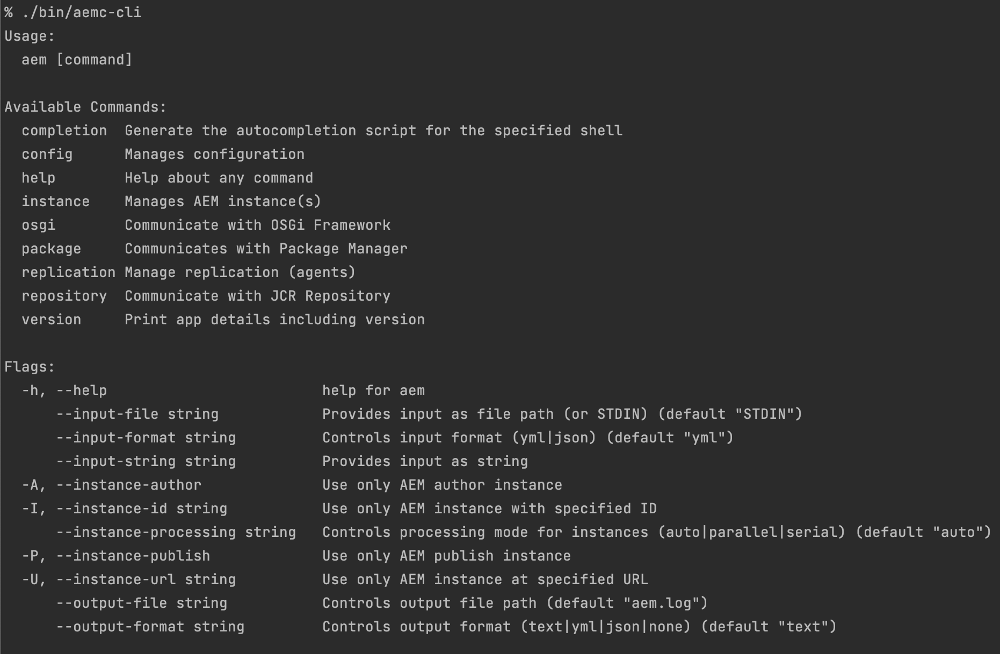

**AEM Compose**

Universal tool to manage AEM instances everywhere!

- Reusable core designed to handle advanced dev-ops operations needed to manage AEM instances
- Various distributions based on core for context-specific use cases:
  - [*CLI*](#cli---overview) - for developer workstations, shell scripting
  - [*Ansible Collection/Modules*](#ansible-collection) - for managing higher AEM environments
- Fast & lightweight
- No dependencies - usable on all operating systems and architectures

# Table of Contents

* [Distributions](#distributions)
  * [CLI - Overview](#cli---overview)
  * [CLI - AEM Project Quickstart](#cli---aem-project-quickstart)
  * [CLI - Building &amp; installing from source](#cli---building--installing-from-source)
  * [Ansible Collection](#ansible-collection)
  * [Go Scripting](#go-scripting)
* [Dependencies](#dependencies)
* [Configuration](#configuration)
  * [Generating default configuration](#generating-default-configuration)
  * [Configuration precedence](#configuration-precedence)
  * [Performance optimization](#performance-optimization)
* [Dev setup](#dev-setup)
  * [Prerequisites](#prerequisites)
  * [Releasing](#releasing)
* [Contributing](#contributing)
* [License](#license)

# Distributions

## CLI - Overview

Provides complete set of commands to comfortably work with CRX packages, OSGi configurations, repository nodes and more.

Key assumptions:

- Rich configuration options
- Self-describing, both machine & human-readable 
- Multiple input & output formats (text/yaml/json)



## CLI - AEM Project Quickstart

Run command below to initialize AEM Compose tool in your project (e.g generated from [Adobe AEM Project Archetype](https://github.com/adobe/aem-project-archetype#usage)):

```shell
curl https://raw.githubusercontent.com/wttech/aemc/main/project/init.sh | sh
```

After successful initialization, remember to always use the tool via wrapper script in the following way:

```shell
sh aemw [command]
```

For example:

```shell
sh aemw version
```

## CLI - Building & installing from source

Ensure having installed [Go](https://go.dev/dl/) then run command:

- latest released version: `go install github.com/wttech/aemc/cmd/aem@latest`,
- specific released version: `go install github.com/wttech/aemc/cmd/aem@v0.6.4`,
- recently committed version: `go install github.com/wttech/aemc/cmd/aem@main`,

## Ansible Collection

See a separate project based on AEM Compose: <https://github.com/wttech/aemc-ansible>

## Go Scripting

Consider implementing any application on top of AEM Compose API like using snippet below:

File: *aem.go*

```go
package main

import "fmt"
import "os"
import aemc "github.com/wttech/aemc/pkg"

func main() {
    aem := aemc.NewAem()
    instance := aem.InstanceManager().NewLocalAuthor()
    changed, err := instance.PackageManager().DeployWithChanged("/tmp/my-package.zip")
    if err != nil {
        fmt.Printf("cannot deploy package: %s\n", err)
        os.Exit(1)
    }
    if changed {
      aem.InstanceManager().AwaitStartedOne(instance)
    }
    fmt.Printf("package deployed properly\n")
    os.Exit(0)
}
```

Then to run application use command:

```shell
go run aem.go
```

# Dependencies

This tool is written in Go. Go applications are very often self-sufficient which means that they are not relying on platform-specific libraries/dependencies. 
The only requirement is to use proper tool binary distribution for each operating system and architecture.
Check out [releases page](https://github.com/wttech/aemc/releases) to review available binary distributions.

# Configuration

## Generating default configuration

To start working with tool run command:

```shell
aem config init
```

It will produce default configuration file named *aem.yml*. 
Correct the `dist_file`, `license_file`, `unpack_dir` properties to provide essential files to be able to launch AEM instances.

```yml
log:
  timestamp_format: "2006-01-02 15:04:05"
  full_timestamp: true

#input:
#  format: yml
#  file: STDIN
#
#output:
#  format: text
#  file: aem.log

java:
  #home_dir: /Library/Java/JavaVirtualMachines/jdk-11.0.15.jdk/Contents/Home

instance:

  # Processing mode
  # 'auto'     - for more than 1 local instances - 'serial', otherwise 'parallel'
  # 'parallel' - for working with remote instances
  # 'serial'   - for working with local instances
  processing_mode: auto

  # Defined by single value (only remote)
  config_url: ''

  # Defined strictly with full details (local or remote)
  config:
    local_author:
      http_url: http://localhost:4502
      user: admin
      password: admin
      run_modes: [ local, scene7 ]
    local_publish:
      http_url: http://localhost:4503
      user: admin
      password: admin
      run_modes: [ local, scene7 ]

  # Filters for defined
  filter:
    id: ''
    author: false
    publish: false

  # State checking
  check:
    interval: 5s

    bundle_stable:
      symbolic_names_ignored: []

  # Managed locally (set up automatically)
  local:
    unpack_dir: '/path/to/aem/data/instances'
    quickstart:
      dist_file: '/path/to/aem/files/aem-sdk-quickstart-2022.7.8005.jar'
      license_file: '/path/to/aem/files/license.properties'

  package:
    upload:
      force: false

  osgi:
    install:
      start: true
      start_level: 20
      refresh_packages: true

```

After instructing tool where the AEM instances files are located then, finally, instances may be created and launched:

```shell
aem instance create
aem instance start
```

## Configuration precedence

All configuration options specified in file *aem.yml* could be overridden by environment variables.
Simply add prefix `AEM_` then each level of nested YAML object join with `_` and lowercase the name of each object.

For example: `instance.local.quickstart.dist_file` could be overridden by environment variable `AEM_INSTANCE_LOCAL_QUICKSTART_DIST_FILE`

Also note that some configuration options may be ultimately overridden by CLI flags, like `--output-format`.

## Performance optimization

By default, fail-safe options are in use. However, to achieve maximum performance of the tool, considering setting these options:

```shell
export AEM_OUTPUT_MODE=none
export AEM_INSTANCE_PROCESSING_MODE=parallel
```

# Dev setup

## Prerequisites

1. Install Go: <https://go.dev/doc/install>,
2. Set up shell, append lines *~/.zshrc* with content below then restart IDE/terminals,

```shell
export GOPATH="$HOME/go"
export PATH="$GOPATH/bin:$PATH"
```

## Releasing

Simply run script:

```shell
sh release.sh <major.minor.patch>
```

It will:

* bump version is source files automatically,
* commit changes,
* push release tag that will initiate [release workflow](.github/workflows/release.yml).

# Contributing

Issues reported or pull requests created will be very appreciated.

1. Fork plugin source code using a dedicated GitHub button.
2. Do code changes on a feature branch created from *develop* branch.
3. Create a pull request with a base of *develop* branch.

# License

**AEM Compose** is licensed under the [Apache License, Version 2.0 (the "License")](https://www.apache.org/licenses/LICENSE-2.0.txt)
